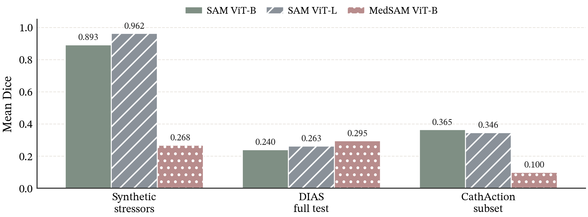

# AngioStress: A Deterministic Stress-Test Benchmark for Construct Validity in Frozen Endovascular Perception Models

## Abstract

Endovascular perception models are increasingly evaluated on real angiography, but ordinary test sets do not isolate which acquisition or scene factors drive failure. AngioStress is a deterministic synthetic stress-test benchmark designed to measure whether controlled digital subtraction angiography (DSA)-like stressor severity predicts the ordering of failures observed on real angiography. The current AngioStress evaluation package builds a TopCoW-derived DSA-like projection with pixel-level ground truth, evaluates three frozen promptable segmentation models without training or fine-tuning, and compares synthetic model ordering against DIAS and CathAction real-angiography surfaces. The benchmark scaffold is reproducible and all evaluated model-surface cells produce finite metrics. Construct-validity evidence is mixed: the full DIAS test split is discordant with the synthetic ordering, while the CathAction human-segmentation subset shows partial agreement in which MedSAM ViT-B remains the weakest model but SAM ViT-B and SAM ViT-L swap order relative to the synthetic surface. These results support AngioStress as a measurement instrument for exposing rank-transfer failures, not as a clinical validation benchmark or a claim of sim-to-real transfer.

## Introduction

Real angiography benchmarks are necessary for model evaluation, but they rarely provide controlled variation over stressors such as frame sparsity, contrast phase, or device overlays. A model can fail under a real dataset shift without revealing whether the failure corresponds to a controllable visual factor. Conversely, a synthetic stress test can be reproducible and precisely labeled while still failing to predict real failures. The central question for AngioStress is therefore construct validity: whether controlled synthetic DSA stressor severity predicts the ordering of model failures on real angiography.

AngioStress treats synthetic data as a measurement instrument rather than as a substitute for clinical data. The benchmark fixes the anatomy source, renderer, stressor parameters, prompt protocol, and metrics, then asks whether model rankings transfer to real surfaces under an explicitly frozen evaluation harness. Agreement would support the stressor as a useful construct-validity probe. Disagreement is also informative because it identifies real failure surfaces that the synthetic stressors do not yet capture.

The current evidence package evaluates three frozen models: SAM ViT-B, SAM ViT-L, and MedSAM ViT-B. The results support three bounded claims. First, the deterministic renderer and frozen-model harness are operational and reproducible for a TopCoW-derived DSA-like benchmark scaffold. Second, synthetic-to-real rank transfer is partial rather than uniform: DIAS is discordant, whereas CathAction human-segmentation evidence shows stable MedSAM-last behavior with a SAM-B/SAM-L order swap. Third, the discordance is a benchmark result, not a failure to hide; it defines which real surfaces remain outside the current synthetic construct.

## Related Work

AngioStress is positioned among DSA sequence segmentation benchmarks, endovascular intervention understanding datasets, promptable segmentation foundation models, topology-aware vascular metrics, and robustness evaluation. DIAS and CathAction provide the real angiography surfaces used here for construct-validity checks [@dias2023; @cathaction2024]. TopCoW provides the current source anatomy for the deterministic synthetic scaffold [@topcow2023]. SAM and MedSAM provide frozen promptable segmentation models whose off-the-shelf behavior can be evaluated without model improvement [@sam2023; @medsam2023]. Metrics such as Dice, clDice, and Betti-style topology matching motivate reporting beyond pixel overlap alone [@cldice2020; @bettimatching2022]. DSA-specific interpolation work such as MoSt-DSA and GaraMoSt shows that synthetic and motion-aware angiography modeling is an active neighboring direction, but AngioStress differs by evaluating controlled stressors as measurement instruments rather than training interpolation models [@mostdsa2024; @garamost2024]. Foundation-model robustness work motivates evaluating pretrained model behavior beyond fixed test sets while preserving explicit scope boundaries [@fmrobustness2023].

## Method

AngioStress starts from a labeled Circle-of-Willis geometry derived from TopCoW and produces a deterministic 2D DSA-like projection with a projected pixel mask [@topcow2023]. The current renderer emits a clean image and synthetic stressor cells for frame thinning, contrast phase, and device overlay severity settings. Each stressor cell is generated by fixed configuration and seed choices, allowing output hashes and per-cell metrics to be reproduced.

The model harness evaluates frozen, off-the-shelf promptable segmentation models. No backbone training, fine-tuning, prompt optimization, or model-selection by outcome is used. SAM ViT-B, SAM ViT-L, and MedSAM ViT-B are evaluated through the same bounding-box prompt protocol derived from the available label mask [@sam2023; @medsam2023]. This protocol is intentionally fixed across synthetic and real surfaces so that rank comparisons reflect the evaluation surface rather than ad hoc per-model prompt tuning.

The real-surface checks use DIAS and CathAction as construct-validity probes [@dias2023; @cathaction2024]. DIAS provides labeled DSA sequences for vessel segmentation evaluation. CathAction provides human-segmentation image-mask pairs used here as a device/action-related real angiography surface under a bounded subset protocol. The CathAction pass intentionally uses the small human-segmentation archive and avoids large unrelated local payloads.

## Experimental Setup

The synthetic reference surface is the S2c three-model frozen-panel run. It evaluates mean stressor Dice on the deterministic synthetic cells and defines the current synthetic model order as SAM ViT-L, SAM ViT-B, MedSAM ViT-B.

The DIAS real surface is the S3b full labeled test split. It evaluates 20 DIAS test sequences, 115 frames per model, and 345 total predictions under the same frozen model and prompt protocol. The main statistic is the rank correlation between S2c synthetic mean stressor Dice and DIAS multisequence mean Dice.

The CathAction real surface is the S3f human-segmentation subset. It samples 128 nonempty image-mask pairs from a nonempty universe of 5,225 pairs after excluding 58 empty masks. The run evaluates 384 model-pair predictions and reports mean Dice, mean clDice [@cldice2020], rank correlation against the synthetic order, and fixed-subset bootstrap stability.

Table 2 records the fixed comparison protocol and reproducibility artifacts for the current evaluation package.

| Surface | Data scope | Frozen models | Prompt protocol | Primary metrics | Reproducibility artifacts | Claim role |
| --- | --- | --- | --- | --- | --- | --- |
| Synthetic stressor surface | Deterministic TopCoW-derived stressor cells from the S2c frozen-panel run | SAM ViT-B, SAM ViT-L, MedSAM ViT-B | Bounding box derived from the projected synthetic label mask; no per-model prompt tuning | Mean stressor Dice and clDice; synthetic model order | `experiments/main/run-angiostress-s2c-third-frozen-model-panel-extension/outputs/model_summary.json`; `experiments/main/run-angiostress-s2c-third-frozen-model-panel-extension/outputs/synthetic_per_cell_metrics.json` | Defines the current synthetic reference order and verifies the three-model frozen panel |
| DIAS real surface | Full labeled DIAS test split, 20 sequences (`s40`-`s59`), 115 frames per model | SAM ViT-B, SAM ViT-L, MedSAM ViT-B | Label-derived bounding box under the same frozen prompt policy; no training or fine-tuning | Mean Dice; Spearman and Kendall rank diagnostics against S2c; sequence-bootstrap Spearman interval | `experiments/analysis/s3b-dias-full-test-split-ranking/outputs/model_summary.json`; `experiments/analysis/s3b-dias-full-test-split-ranking/outputs/ranking_diagnostics.json` | Measures DIAS rank transfer and supports the discordant construct-validity finding |
| CathAction real surface | Fixed 128-pair nonempty human-segmentation subset sampled from 5,225 nonempty pairs after excluding 58 empty masks | SAM ViT-B, SAM ViT-L, MedSAM ViT-B | Label-derived bounding box under the same frozen prompt policy; no training or fine-tuning | Mean Dice, mean clDice, Spearman rank diagnostic, fixed-subset bootstrap interval, order-match rates | `experiments/analysis/s3f-cathaction-human-segmentation-subset-ranking/outputs/model_summary.json`; `experiments/analysis/s3f-cathaction-human-segmentation-subset-ranking/outputs/stability_summary.json` | Measures bounded CathAction rank transfer and supports partial agreement with a SAM ViT-B/SAM ViT-L swap |

Because the current panel contains three frozen models, rank correlations are interpreted as coarse ordering diagnostics. Bootstrap intervals quantify resampling stability under the fixed DIAS or CathAction surface, not complete benchmark-wide uncertainty.

## Results

### Deterministic Synthetic Scaffold

The initial renderer-smoke pass generated nine stressor cells across frame thinning, contrast phase, and device overlay. Required outputs were present, clean ground-truth self Dice and self clDice were both 1.0, and rerun output hashes matched. The frozen SAM ViT-B harness then produced finite synthetic and stressed-cell predictions, with clean Dice 0.981 and mean stressor Dice 0.893. This establishes a reproducible benchmark scaffold, not a construct-validity result by itself.

### Frozen Model Panel

The S2c three-model panel extended the harness to SAM ViT-B, SAM ViT-L, and MedSAM ViT-B. On the synthetic stressor surface, mean stressor Dice was 0.962 for SAM ViT-L, 0.893 for SAM ViT-B, and 0.268 for MedSAM ViT-B. The resulting synthetic order was SAM ViT-L, SAM ViT-B, MedSAM ViT-B.

### DIAS Construct-Validity Diagnostic

On the full DIAS test split, the observed mean-Dice order was MedSAM ViT-B, SAM ViT-L, SAM ViT-B. Mean Dice was 0.295 for MedSAM ViT-B, 0.263 for SAM ViT-L, and 0.240 for SAM ViT-B. This is discordant with the synthetic order. The aggregate Spearman correlation between the synthetic order and DIAS multisequence mean Dice was -0.5, and the aggregate Kendall correlation was -0.333. Sequence-bootstrap diagnostics preserved the negative direction, with Spearman mean -0.425 and 95% interval [-0.675, -0.125].

### CathAction Construct-Validity Diagnostic

On the S3f CathAction human-segmentation subset, the observed mean-Dice order was SAM ViT-B, SAM ViT-L, MedSAM ViT-B. Mean Dice was 0.365 for SAM ViT-B, 0.346 for SAM ViT-L, and 0.100 for MedSAM ViT-B. The rank correlation against the synthetic order was Spearman 0.5. Fixed-subset bootstrap gave mean Spearman 0.5285 and percentile interval [0.5, 1.0]. The observed subset order appeared in 94.3% of bootstrap draws, whereas the exact synthetic order appeared in 5.7% of draws. This supports partial agreement: MedSAM ViT-B is consistently weakest, but the SAM ViT-B and SAM ViT-L ordering is not preserved.

### Cross-Surface Synthesis

Table 1 summarizes the current rank-transfer evidence. Figure 1 visualizes the same model-by-surface mean Dice values.

Mean Dice for three frozen promptable segmentation models on the synthetic and real AngioStress evaluation surfaces. Synthetic values summarize S2c stressor cells; DIAS and CathAction values summarize the S3b full test split and S3f fixed subset. The ordering is not preserved uniformly: DIAS is discordant with the synthetic order, while CathAction preserves MedSAM-last behavior but swaps SAM ViT-B and SAM ViT-L. Publication-grade figure refinement is recommended with AutoFigure-Edit (open-source: https://github.com/ResearAI/AutoFigure-Edit; online service: https://deepscientist).

| Surface | Evaluation scope | Mean Dice order | Rank diagnostic vs. synthetic order |
| --- | --- | --- | --- |
| Synthetic stressors | Deterministic TopCoW-derived stressor cells | SAM ViT-L (0.962), SAM ViT-B (0.893), MedSAM ViT-B (0.268) | Reference order |
| DIAS full test | 20 labeled test sequences, 115 frames per model | MedSAM ViT-B (0.295), SAM ViT-L (0.263), SAM ViT-B (0.240) | Spearman -0.5; Kendall -0.333; bootstrap Spearman mean -0.425, 95% CI [-0.675, -0.125] |
| CathAction subset | 128 nonempty pairs per model | SAM ViT-B (0.365), SAM ViT-L (0.346), MedSAM ViT-B (0.100) | Spearman 0.5; bootstrap Spearman mean 0.5285, interval [0.5, 1.0] |

The current evidence is therefore mixed. AngioStress can measure failures reproducibly, but the current synthetic stressors do not induce a model ranking that transfers uniformly to DIAS and CathAction. That mixed outcome is construct-validity evidence: it shows where the synthetic benchmark is aligned with a real surface and where it is not.

## Limitations

This initial evaluation package evaluates one synthetic anatomy source, three promptable segmentation models, and a fixed bounding-box prompt protocol. The DIAS analysis uses sequence-level masks and the CathAction analysis uses a bounded human-segmentation subset. The CathAction subset is not a full CathAction population estimate, and the current intervals are rank-stability diagnostics rather than final benchmark-wide confidence intervals. The benchmark does not make clinical-accuracy claims, does not evaluate clinical outcomes, and does not claim sim-to-real transfer.

The current stressor set is also incomplete relative to the intended AngioStress v0.1 scope. Frame thinning, contrast phase, and device overlay stressors are implemented in the scaffold, but additional stressors, larger model panels, detector-backed failure tags, and stronger dose-response/separability analyses remain future work before a complete release claim.

The current evaluation package also does not establish a final leaderboard, a complete six-stressor release, or a final construct-validity estimate.

## Conclusion

AngioStress is currently best described as a deterministic benchmark scaffold plus a first construct-validity diagnostic. The scaffold and frozen-model harness are reproducible, and the real-surface checks show that synthetic stressor rankings only partially predict real model ordering. DIAS is discordant under the fixed protocol, while CathAction human segmentation shows stable partial agreement with MedSAM ViT-B last and a SAM ViT-B/SAM ViT-L swap. This supports continuing AngioStress as a measurement benchmark whose value includes exposing disagreements between controlled synthetic stressors and real angiography surfaces.

## Data and Code Availability

The redistributable AngioStress paper package, reproducibility manifests, derived metrics, figures, tables, and release inventory are publicly available at `https://github.com/txmed82/angiostress-benchmark-artifacts` and mirrored as a Hugging Face dataset at `https://huggingface.co/datasets/txmedai/angiostress-benchmark-artifacts`. The repositories contain the manuscript source and PDF, figure assets, tables, package manifests, evidence ledgers, derived metric summaries, and data-source inventory needed to inspect the reported analyses.

Raw third-party datasets and model checkpoints are not redistributed in the AngioStress artifact package. DIAS data should be obtained from the official DIAS sources, including `https://github.com/lseventeen/DIAS` and `https://doi.org/10.5281/zenodo.11396520` [@dias2023]. CathAction data should be obtained from the official CathAction project source at `https://github.com/airvlab/cathaction` and the access route described by the CathAction authors [@cathaction2024]. TopCoW source anatomy should be obtained from the official TopCoW challenge/data release routes described by the TopCoW authors [@topcow2023]. SAM and MedSAM checkpoints should be obtained from their respective public project releases [@sam2023; @medsam2023]. Readers should follow the original licences, access terms, and citation requirements for all third-party datasets and model weights.
